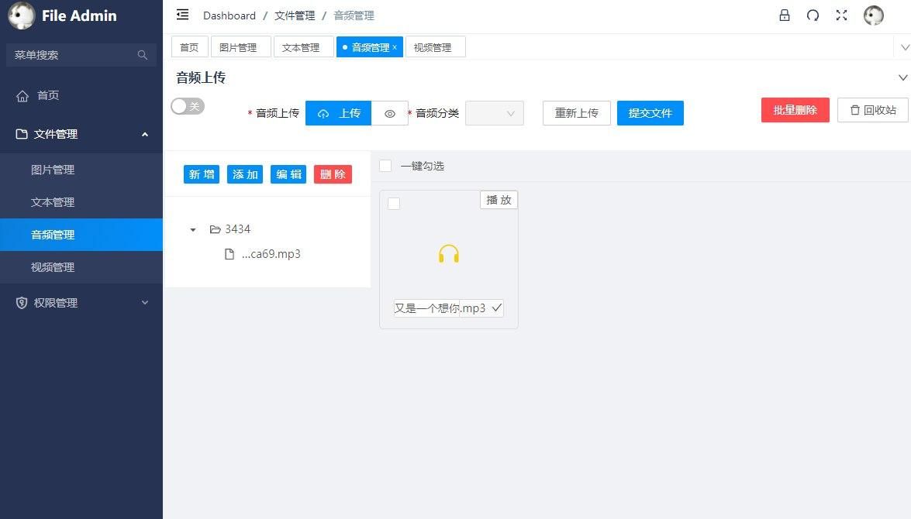

# FileManage
>项目背景：用于个人文件管理，收藏

项目基于vue3

- hook组件封装
- typescript

# 后台管理界面


## 后台
[FileManageApi](https://github.com/renserve/fileManageApi)

登录账号super，密码：123456

## Run

``` bash

# 安装依赖
npm install

# 查看package.json script运行命令
npm run dev

```
### 参考项目
[vue-vben-admin-thin](https://github.com/NumenJamila/vue-vben-admin-thin)
